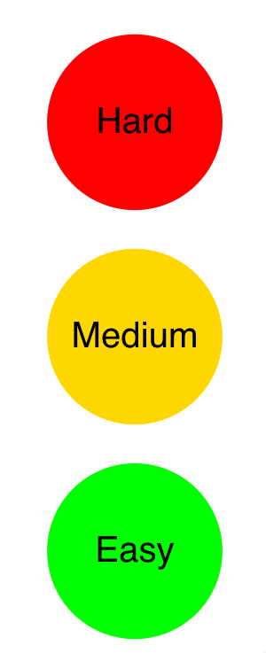

```{r setup, include=FALSE}
library(knitr)
knitr::opts_chunk$set(echo = FALSE)
```


<script type="text/javascript" async
  src="https://cdnjs.cloudflare.com/ajax/libs/mathjax/2.7.5/MathJax.js?config=TeX-MML-AM_CHTML">
</script>

<script>
Reveal.initialize({
    dependencies: [
            ... 
        { src: 'plugin/mouse-pointer/mouse-pointer.js', async: true }, 
    ] 
});
</script>


## A roadmap...

:::: {style="display: flex;"}

::: {}
{ width=200px }
:::

::: {}

\
\

How do we *interpret* confidence intervals?

\
\

How do we *compute* confidence intervals?

\
\

*Why* do we need confidence intervals?


:::

::::

## Confidence interval for a proportion {.smaller .build}
$$
\color{blue}{\text{sample proportion}}  \qquad \color{purple}{\text{critical value}} \qquad \qquad \qquad \qquad \qquad \qquad $$

$$ \color{blue}{\hat{\mathbf{p}} } \qquad \pm \qquad \color{purple}{\mathbf{Z}}_{\color{red}{\alpha} / 2}   \qquad \times  \qquad   \sqrt{ \frac{ \color{blue}{\hat{\mathbf{p}} } ( 1 - \color{blue}{\hat{\mathbf{p}} } )}{\color{green}{\mathbf{n}}} } $$

$$ \qquad \qquad \qquad \color{red}{\text{confidence level}} \qquad  \color{green}{\textrm{sample size}} $$


Let's estimate the **proportion** of women at HKS:


```{r, include=TRUE, echo=TRUE}
# save values
p <- 26/40
alpha <- 0.05
z <- qnorm(alpha/2, lower.tail = FALSE)
n <- 40

# compute lower and upper bounds of the CI
### <b>
ci.lower <- p - z * sqrt( p*(1-p) / n )
ci.upper <- p + z * sqrt( p*(1-p) / n )
### </b>
print(c(ci.lower, ci.upper))
```


## Interpretation

<iframe src="https://sophieehill.shinyapps.io/ci-sims" scrolling= "yes" frameborder="0" allow="fullscreen"></iframe>


## Recap

:::: {style="display: flex;"}

::: {}
{ width=200px }
:::

::: {}

\
**Meaning?**

>"in the long run, 95% of confidence intervals drawn from repeated samples will cover the true value!"


\
**How?**

$$ \color{blue}{\hat{\mathbf{p}} }  \pm  \color{purple}{\mathbf{Z}}_{\color{red}{\alpha} / 2}    \times     \sqrt{ \frac{ \color{blue}{\hat{\mathbf{p}} } ( 1 - \color{blue}{\hat{\mathbf{p}} } )}{\color{green}{\mathbf{n}}} } $$


**Why?** 

>to quantify uncertainty!


:::

::::
